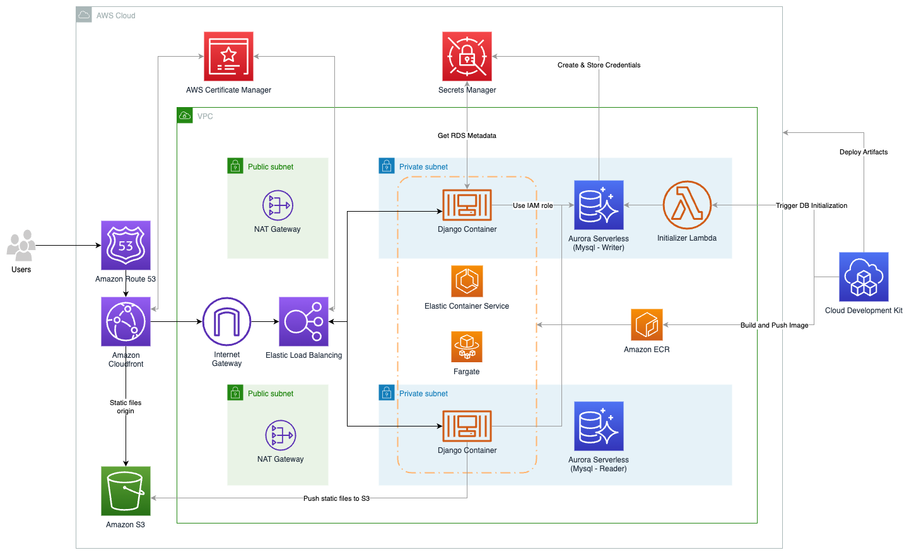

# Sample for a Django Serverless CDK Application using AWS managed services

The purpose of this sample is to demo a serverless CDK stack for a Python [django](https://www.djangoproject.com/) Application that uses Amazon ECS with AWS Fargate, AWS Lambda, Amazon Aurora MySQL-Compatible Edition, Elastic Load Balancing (ELB) and Amazon CloudFront. 

The sample also uses RDS IAM Authentication for the django Backend to avoid hard-coded credentials in the settings file. The user setup is covered by a Lambda custom resource triggered on creation or changes of the database.

Another part of this sample is to use Cloudfront to distribute the traffic to the ELB (Dynamic Django content) and Amazon S3 (django static files) as well as configuring the Django Application to update the static content and database on new deployments.

# Architecture

The following diagram shows the high-level architecture for the solution.



This demo consists out of several components:

- A serverless Aurora Database with Mysql compatibility using IAM Authentication
- AWS Secrets Manager to store the database credentials and metadata (only used for the custom resource on deployment)
- An ECS cluster running the django containers
- An Application Load Balancer to handle the traffic to the ECS cluster
- An Amazon S3 Bucket to store the static files
- A CloudFront distribution for serving the LoadBalancer-Requests and static files
- A Lambda function as a custom resource for creating the database IAM user

# Prerequisites

- AWS Account
- AWS CLI installed and pre configured AWS Credentials
- AWS CDK installed
- [Docker](https://docs.docker.com/get-docker/)
- Existing HostedZone in your Account

**THIS DEMO WAS TESTED IN US-EAST-1 REGION**

# Setup instructions

For the initial deployment you need to clone the repo, install packages and run a CDK Bootstrap to deploy the stack to your AWS Account. The sample already includes a sample django application you can extend or replace with your personal application.

Ensure that you have set up the credentials before running the commands using ```aws configure```.

1. Clone the Repo with ```git clone```
2. Run ```npm install``` in the repository folder

3. The sample is using a config file to define your Account-ID, the region (us-east-1 is recommended as we are using Cloudfront with certifcates) and your already created HostedZone parameters.
Copy the ```config/config.yaml.template``` to ```config/config.yaml``` and adjust the values accordingly.

4. Start the deployment with:

    ```bash
    cdk bootstrap
    cdk deploy --all
    ```

# Where does the magic happen?

## Setup and permissions of the django IAM database user

In ```lib/constructs/db-initializer.ts``` we build a Lambda custom resource being triggered on database creation and updates. The lambda executes a simple SQL script to create the django user with IAM connect permissions and grants access to the main database for django usage. 

```sql
CREATE USER IF NOT EXISTS django IDENTIFIED WITH AWSAuthenticationPlugin AS 'RDS';
GRANT ALL PRIVILEGES ON `main`.* TO 'django'@'%';
FLUSH PRIVILEGES;
```

In ```lib/constructs/django-ecs.ts``` we then attach following IAM policy to the ECS Task role for granting this role access to the database cluster with the previous defined username.

```
djangoTaskRole.addManagedPolicy(new aws_iam.ManagedPolicy(this, 'db-access-policy', {
    statements: [
        new aws_iam.PolicyStatement({
            effect: aws_iam.Effect.ALLOW,
            actions: ["rds-db:connect"],
            resources: [`arn:aws:rds-db:${Stack.of(this).region}:${Stack.of(this).account}:dbuser:${props.dbCluster.clusterResourceIdentifier}/django`]
        })
    ]
}))
```

More details on AWS RDS IAM connections can be found in the [Amazon RDS documentation](https://docs.aws.amazon.com/AmazonRDS/latest/UserGuide/UsingWithRDS.IAMDBAuth.html).

## Accessing the database from within django application

To be able to access the database from within our django application without password we need to make some changes in the standard ```settings.py``` of our django application.

In a first step we import ```boto3``` and use the rds client to generate a temporary password-token.

```python
client = boto3.client('rds')
token = client.generate_db_auth_token(DBHostname=DB_HOST, Port=DB_PORT, DBUsername=DB_USER, Region=REGION)
```

This password token then is used for the database connection.

```python
DATABASES = {
    'default': {
        'ENGINE': 'django.db.backends.mysql',
        'NAME': DB_NAME,
        'USER': DB_USER,
        'PASSWORD': token,
        'HOST': DB_HOST,
        'PORT': DB_PORT,
        'OPTIONS': {'ssl': {'key': 'global-bundle.pem'}}
    }
}
```

## Deploying static files to S3 bucket

To have the static files delivered from a S3 Bucket via Amazon Cloudfront we need to import ```django-storages``` in our settings file and set our static files configuration accordingly

```python
STATICFILES_DIRS = [os.path.join(BASE_DIR,'static-files'),]
STATICFILES_STORAGE = 'storages.backends.s3boto3.S3Boto3Storage'

AWS_STORAGE_BUCKET_NAME = STATIC_BUCKET_NAME
AWS_S3_REGION_NAME = REGION
AWS_LOCATION = 'static'
AWS_S3_CUSTOM_DOMAIN = ALLOWED_HOSTS[0]
STATIC_URL = f'https://{AWS_S3_CUSTOM_DOMAIN}/{AWS_LOCATION}/'
```

With execution of ```python manage.py collectstatic --noinput``` the files will be uploaded to our S3 bucket.


# Testing the solution

After the successful deployment you should be able to reach your Django Application via your specified domain. Feel free to extend the Django App, redeploy your changes and test it again.

# Cleaning up:

```bash
cdk destroy --all
```

## Security

This application was written for demonstration and educational purposes and not for production use. The [Security Pillar of the AWS Well-Architected Framework](https://docs.aws.amazon.com/wellarchitected/latest/security-pillar/welcome.html) can support you in further adopting the sample into a production deployment in addition to your own established processes. Take note of the following:

- In order to simplify the setup of the demo, this solution uses AWS managed policies associated to IAM roles that contain wildcards on resources. Please consider to further scope down the policies as you see fit according to your needs. 

- If your security controls require inspecting network traffic, consider activating Vpc Flow Logs

- As the solution is using Cloudfront, recommendation is to enable Access Loging for the distribution. Additionally the Load Balancer Security group should be limited to the Cloudfront prefix lists

See [CONTRIBUTING](CONTRIBUTING.md#security-issue-notifications) for more information.

## License

This library is licensed under the MIT-0 License. See the LICENSE file.